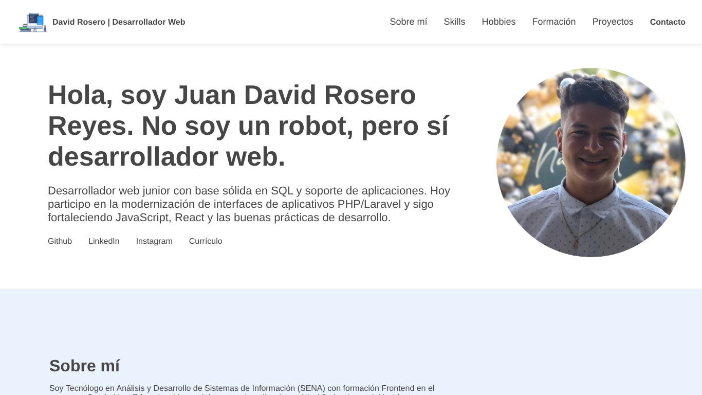

# Portafolio personal · Juan David Rosero Reyes

Sitio web personal donde presento mi perfil, formación y proyectos. Está construido con HTML, CSS y JavaScript puro, con diseño **Mobile First**, y se publica automáticamente con **GitHub Pages** en la raíz de mi dominio de GitHub.


[](https://juan-roserodev.github.io/)

### 🔗 [juan-roserodev.github.io](https://juan-roserodev.github.io/)



---

## ✨ Secciones

- **Presentación** con enlaces a GitHub, LinkedIn y descarga del CV.
- **Sobre mí**, **habilidades** y **hobbies**.
- **Formación académica**: SENA, Oracle Next Education (ONE) y aprendizaje autodidacta.
- **Proyectos** con enlace al repositorio y a la demo de cada uno.
- **Formulario de contacto** con validación en el navegador y envío mediante FormSubmit.

## 🛠️ Stack tecnológico

- **HTML5** semántico
- **CSS3**: Flexbox, media queries, diseño Mobile First
- **JavaScript (ES6)**: validación del formulario de contacto
- **Font Awesome** para íconos y **SweetAlert2** para mensajes
- **GitHub Pages** para el despliegue continuo

## 🗂️ Estructura

```
juan-roserodev.github.io/
├── index.html
├── Css/style.css
├── JavaScript/functions.js   # Validación del formulario de contacto
├── img/                      # Fotos, logos y miniaturas de proyectos
└── Resources/                # Currículum en PDF
```

## 🚀 Uso local

```bash
git clone https://github.com/juan-roserodev/juan-roserodev.github.io.git
```

Abre `index.html` en el navegador o usa la extensión *Live Server* de VS Code. Cualquier cambio que se suba a la rama `main` se publica automáticamente en GitHub Pages.

## ✅ Buenas prácticas aplicadas

- Rutas relativas para imágenes y recursos, de modo que el sitio funciona igual en local y en producción.
- Validación de los campos del formulario antes de habilitar el botón de envío.
- Enlaces externos abiertos en una pestaña nueva.

## 📬 Contacto

- **Email:** [juan.rosero21@hotmail.com](mailto:juan.rosero21@hotmail.com) · [juan.rosero.dev@gmail.com](mailto:juan.rosero.dev@gmail.com)
- **LinkedIn:** [linkedin.com/in/david-reyes-dev](https://www.linkedin.com/in/david-reyes-dev)
- **GitHub:** [@juan-roserodev](https://github.com/juan-roserodev)
